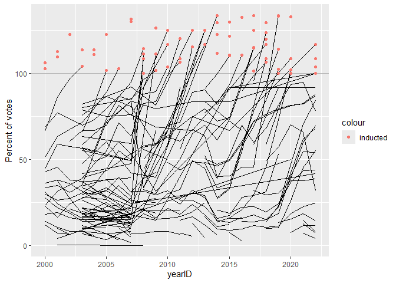

<!-- README.md is generated from README.Rmd. Please edit the README.Rmd file -->

# Lab report \#4 - instructions

Follow the instructions posted at
<https://ds202-at-isu.github.io/labs.html> for the lab assignment. The
work is meant to be finished during the lab time, but you have time
until Monday (after Thanksgiving) to polish things.

All submissions to the github repo will be automatically uploaded for
grading once the due date is passed. Submit a link to your repository on
Canvas (only one submission per team) to signal to the instructors that
you are done with your submission.

# Lab 4: Scraping (into) the Hall of Fame

    ## package 'Lahman' successfully unpacked and MD5 sums checked
    ## 
    ## The downloaded binary packages are in
    ##  C:\Users\gizmo\AppData\Local\Temp\RtmpCI7CdY\downloaded_packages

<!-- --> \# Hall of
Fame Dataset

## Scraping

``` r
library(tidyverse)
library(rvest)
```

    ## 
    ## Attaching package: 'rvest'

    ## The following object is masked from 'package:readr':
    ## 
    ##     guess_encoding

``` r
library(janitor)
```

    ## 
    ## Attaching package: 'janitor'

    ## The following objects are masked from 'package:stats':
    ## 
    ##     chisq.test, fisher.test

``` r
library(Lahman)

website <- read_html("https://www.baseball-reference.com/awards/hof_2026.shtml")

df <- website %>% html_element("#hof_BBWAA") %>% html_table() 
df <- df %>% row_to_names(1) %>% clean_names %>% select(1:10)
```

    ## Warning: Row 1 does not provide unique names. Consider running clean_names()
    ## after row_to_names().

``` r
df %>% mutate(votes = as.numeric(votes), percent_vote = as.numeric(str_remove(percent_vote, "%")), yo_b = as.numeric(str_remove(yo_b, "st|th|rd|nd")), ho_fm = as.numeric(ho_fm), ho_fs = as.numeric(ho_fs),yrs = as.numeric(yrs), inducted = percent_vote >= 75)
```

    ## # A tibble: 27 × 11
    ##    rk    name     yo_b votes percent_vote ho_fm ho_fs   yrs war   war7  inducted
    ##    <chr> <chr>   <dbl> <dbl>        <dbl> <dbl> <dbl> <dbl> <chr> <chr> <lgl>   
    ##  1 1     Carlos…     4   358         84.2   126    50    20 70.0  44.4  TRUE    
    ##  2 2     Andruw…     9   333         78.4   109    32    17 62.7  46.4  TRUE    
    ##  3 3     Chase …     3   251         59.1    94    36    16 64.6  49.3  FALSE   
    ##  4 4     Andy P…     8   206         48.5   128    44    18 60.2  34.1  FALSE   
    ##  5 5     Félix …     2   196         46.1    67    31    15 49.8  38.5  FALSE   
    ##  6 6     Alex R…     5   170         40     390    77    22 117.4 64.3  FALSE   
    ##  7 7     X-Mann…    10   165         38.8   226    68    19 69.3  40.0  FALSE   
    ##  8 8     Bobby …     7   131         30.8    95    52    18 60.2  41.6  FALSE   
    ##  9 9     Jimmy …     5   108         25.4   121    42    17 47.9  32.7  FALSE   
    ## 10 10    Cole H…     1   101         23.8    57    33    15 59.0  37.4  FALSE   
    ## # ℹ 17 more rows

``` r
df
```

    ## # A tibble: 27 × 10
    ##    rk    name            yo_b  votes percent_vote ho_fm ho_fs yrs   war   war7 
    ##    <chr> <chr>           <chr> <chr> <chr>        <chr> <chr> <chr> <chr> <chr>
    ##  1 1     Carlos Beltrán  4th   358   84.2%        126   50    20    70.0  44.4 
    ##  2 2     Andruw Jones    9th   333   78.4%        109   32    17    62.7  46.4 
    ##  3 3     Chase Utley     3rd   251   59.1%        94    36    16    64.6  49.3 
    ##  4 4     Andy Pettitte   8th   206   48.5%        128   44    18    60.2  34.1 
    ##  5 5     Félix Hernández 2nd   196   46.1%        67    31    15    49.8  38.5 
    ##  6 6     Alex Rodriguez  5th   170   40.0%        390   77    22    117.4 64.3 
    ##  7 7     X-Manny Ramirez 10th  165   38.8%        226   68    19    69.3  40.0 
    ##  8 8     Bobby Abreu     7th   131   30.8%        95    52    18    60.2  41.6 
    ##  9 9     Jimmy Rollins   5th   108   25.4%        121   42    17    47.9  32.7 
    ## 10 10    Cole Hamels     1st   101   23.8%        57    33    15    59.0  37.4 
    ## # ℹ 17 more rows

``` r
final_df <- df %>% select(1:5)
```
